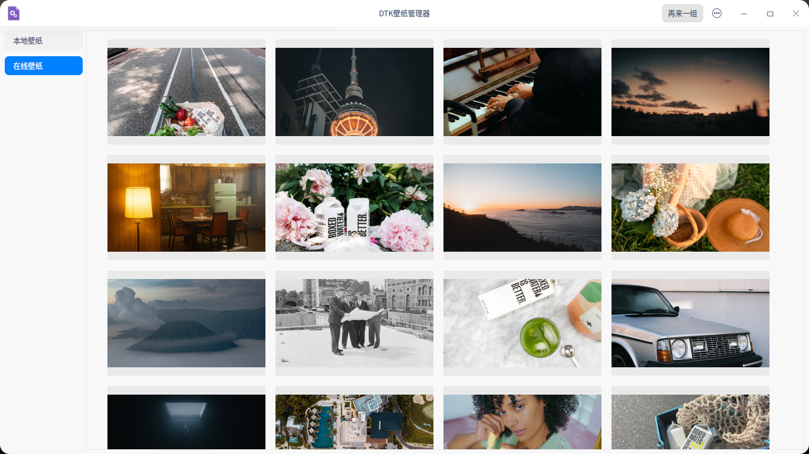

## 简介
本项目是一个壁纸管理器的Demo，使用了DIconButton，DSpinner，DImageViewer等 DTK组件，可以查看本地系统壁纸和在线的壁纸，还可以可以实现查看壁纸大图，保存图片设置壁纸等功能

> github仓库：https://github.com/mhduiy/DTKWallpaperManager

### 展示图


## 构建步骤
```bash
mkdir build
cd build
cmake ..
make
```
## 详细开发文档
### 一、安装dtk组件
因为项目采用许多dtk组件，需要我们提前安装好dtk的各种核心库和依赖

#### 方法一
一句命令即可安装Dtk相关开发环境

`libdtk{core,widget,gui}-dev` 等价于 `deepin-sdk`

```bash
sudo apt install deepin-sdk qtcreator-template-dtk
```
#### 方法二
##### 安装 dtkcommon
```bash
git clone https://github.com/linuxdeepin/dtkcommon.git -b 5.6.4
cd dtkcommon
# 安装依赖
sudo apt build-dep .
# 构建
dpkg-buildpackage -us -uc -b
# 安装上一级目录的所有deb文件，若上一级有其他的deb文件，请手动安装
sudo dpkg -i ../*.deb
```
##### 安装 dtkcore
dtkcore 是一个基于Qt的C++库，它提供了一些常用的工具类，以及一些基础的模块，如日志、插件、网络、线程、数据库、文件、图形、音频、视频、系统信息等
```bash
git clone https://github.com/linuxdeepin/dtkcommon.git -b 5.6.4
cd dtkcommon
sudo apt build-dep .
dpkg-buildpackage -us -uc -b
sudo dpkg -i ../*.deb
```
##### 安装 dtkgui
```bash
git clone https://github.com/linuxdeepin/dtkcommon.git -b 5.6.4
cd dtkcommon
sudo apt build-dep .
dpkg-buildpackage -us -uc -b
sudo dpkg -i ../*.deb
```
##### 安装 dtkwidget
dtkwidget是dtk对于qtwidget的封装与扩充，方便用户快速开发符合dtk视觉风格的应用。其中重写了部分qtwidget的控件，以及提供了一些新的控件，提供给开发者一个更轻松美观的选择。
```bash
git clone https://github.com/linuxdeepin/dtkcommon.git -b 5.6.4
cd dtkcommon
sudo apt build-dep .
dpkg-buildpackage -us -uc -b
sudo dpkg -i ../*.deb
```
> dtk官方文档链接：https://docs.deepin.org/info/%E5%BC%80%E5%8F%91%E5%85%A5%E9%97%A8/%E5%9F%BA%E7%A1%80%E7%8E%AF%E5%A2%83/DTK/%E5%BC%80%E5%8F%91

### 二、编写CMakeLists.txt

此处列出完整的CMakeLists.txt文件

```cmake
# 配置需求cmake的最低版本
cmake_minimum_required(VERSION 3.1.0)

# 设置项目名称，版本，语言
project(DTKWallpaperManager VERSION 1.0.0 LANGUAGES CXX)

# 指定c++的标准要求，这里选择c++11以上
set(CMAKE_CXX_STANDARD 11)
set(CMAKE_CXX_STANDARD_REQUIRED ON)

# 设置支持Qt moc文件
set(CMAKE_AUTOMOC ON)
# 设置支持Qt 资源文件
set(CMAKE_AUTORCC ON)

# 寻找Qt核心库 widget gui
find_package(Qt5 COMPONENTS Widgets REQUIRED)
find_package(Qt5 COMPONENTS Gui  REQUIRED)
# 寻找Dtk核心库 widget core gui
find_package(Dtk COMPONENTS Widget REQUIRED)
find_package(Dtk COMPONENTS Core REQUIRED)
find_package(Dtk COMPONENTS Gui)

# 寻找 src 文件夹下的所有源文件并保存在 SRC 中
file(GLOB SRC src/*.cpp)
# 寻找 include文件夹下的所有头文件并保存在 HEAD 中
file(GLOB HEAD include/*.h)

# 包含 include 文件夹下的头文件
include_directories(include)

# 添加可执行文件目标，源文件，头文件和资源文件
add_executable(${PROJECT_NAME}
        ${SRC} ${HEAD}
        resources.qrc)

# 设置项目需要的模块及其库文件
target_link_libraries(DTKWallpaperManager PRIVATE
    Qt5::Widgets
    Qt5::Gui
    Qt5::Network
    ${DtkGui_LIBRARIES}
    ${DtkCore_LIBRARIES}
    ${DtkWidget_LIBRARIES}
) 

```
### 三、界面设计

#### 简要介绍

本项目目前主要功能有本地图片，在线图片，查看大图，保存壁纸，设置壁纸等
因为控件不算多，这里将所有的空间都放在主界面(MainWindow)中，具体细节如下：
1. MainWindow的中心控件是一个DStackedWidget
   1. 界面1：包含左侧选择本地壁纸和在线壁纸的功能列表以及右侧的图片浏览界面
   2. 界面2：包含一个DImageViewer控件，用于显示图片
2. 最外层DStackedWidget左侧功能界面使用DListView
3. 最外层DStackedWidget右侧图片浏览界面使用一个DStackedWidget的两个界面来分别显示本地图片和在线图片
4. 将设置壁纸和再来一组功能合并为一个按钮放在titlebar的右侧，titlebar右侧还有保存壁纸和一个加载动画的控件(DSpinner)
5. titlebar左侧是一个返回按钮，在特定的场景才会出现

#### 设计图展示


#### 程序设计

该部分代码截取自`src/mainWindow.cpp`和`include/mainWindow.h`

```c++
//代码截取自mainWindow.h
class MainWindow {
private:
    QThreadPool *pool;                  //全局线程池
    DListView *funcModLV;               //在线壁纸和本地壁纸的功能模块
    DStackedWidget *mainStacked;        //最外层stack，一个显示主界面，一个显示图片详情
    DStackedWidget *imgStacked;         //图片流界面deepin
    DWidget *mainWidget;                //主界面
    DImageViewer *imgViewer;            //图片显示
    QStandardItemModel *model;          //左侧功能区model
    DFlowLayout *imgFlowOnline;         //在线壁纸flow
    DFlowLayout *imgFlowLocal;          //本地壁纸flow
    DWidget *imgWidgetOnline;           //在线壁纸窗口
    DWidget *imgWidgetLocal;            //本地壁纸窗口
    DScrollArea *scrollareaLocal;       //本地壁纸滚动区域
    DScrollArea *scrollareaOnline;      //在线壁纸滚动区域
    DWidget *imgfixWidgetLocal;         //本地壁纸外层窗口，在scrollArea内一层，用于居中其内部的Widget(该widget为流布局)，实现流布局的居中
    DWidget *imgfixWidgetOnline;        //在线壁纸外层窗口，...
    QNetworkAccessManager  *networkAccessManager;   //网络连接管理
    QVector<DIconButton*> imgsLocal;    //本地图片
    QVector<DIconButton*> imgsOnline;   //在线图片
    QHash<int, QImage*> imgsLocalMap;   //从硬盘读取的本地图片
    QHash<int, QImage*> imgsOnlineMap;  //从硬盘中读取的在线图片
    DPushButton *returnBtn;             //返回按键
    DPushButton *funcBtn;               //功能按键（刷新页面，设置壁纸）
    DPushButton *saveBtn;               //保存壁纸按钮
    DSpinner *spinner;                  //加载spinner
};
```

```c++
//代码截取自mainWindow.cpp
void MainWindow::initUI()
{
    //设置titleBar部分
    returnBtn = new DPushButton();
    funcBtn = new DPushButton("再来一组");
    spinner = new DSpinner();
    saveBtn = new DPushButton("保存壁纸");
    //设置加入titlebar各个组件的默认大小
    returnBtn->setFixedWidth(40);
    saveBtn->setFixedWidth(80);
    funcBtn->setFixedWidth(80);
    spinner->setFixedSize(30,30);

    returnBtn->setIcon(QIcon(":/images/left-arrow.png"));
    returnBtn->setIconSize(QSize(20,20));

    //将设置的组件默认隐藏
    returnBtn->hide();
    funcBtn->hide();
    spinner->hide();
    saveBtn->hide();
    //添加组件到titlebar并设置对齐方式
    this->titlebar()->addWidget(returnBtn, Qt::AlignLeft);
    this->titlebar()->addWidget(spinner, Qt::AlignRight);
    this->titlebar()->addWidget(saveBtn, Qt::AlignRight);
    this->titlebar()->addWidget(funcBtn, Qt::AlignRight);
    //最外层stackedWidget
    mainStacked = new DStackedWidget(this);
    //主界面窗口
    mainWidget = new DWidget();
    //设置主界面的layout
    QHBoxLayout *mainLayout = new QHBoxLayout(mainWidget);

    //左侧功能模块按钮区
    funcModLV  = new DListView();
    model = new QStandardItemModel();
    //向功能区添加两个项目
    model->appendRow(new DStandardItem("本地壁纸"));
    model->appendRow(new DStandardItem("在线壁纸"));
    funcModLV->setModel(model);
    //设置固定大小
    funcModLV->setFixedWidth(150);
    //设置DListView不可编辑
    funcModLV->setEditTriggers(DListView::EditTrigger::NoEditTriggers);

    //右侧图片流显示区域
    //新建滚动区域
    scrollareaLocal = new DScrollArea();
    scrollareaOnline = new DScrollArea();

    imgStacked  = new DStackedWidget();
    imgWidgetLocal = new DWidget();
    imgWidgetOnline = new DWidget();

    imgFlowLocal = new DFlowLayout(imgWidgetLocal);
    imgFlowOnline = new DFlowLayout(imgWidgetOnline);

    //设置流式布局属性
    imgFlowLocal->setSpacing(20);
    imgFlowOnline->setSpacing(20);


    //将本地和在线的图片窗口设置为流式布局
    imgWidgetLocal->setLayout(imgFlowLocal);
    imgWidgetOnline->setLayout(imgFlowOnline);

    //新建一个窗体，内部存放流布局的另外一个widget，可实现流布局窗口的居中
    QVBoxLayout *localVLayout = new QVBoxLayout();
    //设置居中
    localVLayout->setAlignment(Qt::AlignHCenter);
    imgfixWidgetLocal = new DWidget();
    localVLayout->addWidget(imgWidgetLocal);
    imgfixWidgetLocal->setLayout(localVLayout);

    QVBoxLayout *onlineVLayout = new QVBoxLayout();
    onlineVLayout->setAlignment(Qt::AlignHCenter);
    imgfixWidgetOnline = new DWidget();
    onlineVLayout->addWidget(imgWidgetOnline);
    imgfixWidgetOnline->setLayout(onlineVLayout);

    //将两个流式布局的外层窗口添加到滚动区域中
    scrollareaLocal->setWidget(imgfixWidgetLocal);
    scrollareaOnline->setWidget(imgfixWidgetOnline);

    //将两个滚动区域添加到imgStacked中
    imgStacked->addWidget(scrollareaLocal);
    imgStacked->addWidget(scrollareaOnline);

    //将左侧功能区和右侧图片流区域添加在mainLayout
    mainLayout->addWidget(funcModLV);
    mainLayout->addWidget(imgStacked);

    //将主界面和显示图片大图的界面添加到最外层StackedWidget
    mainStacked->addWidget(mainWidget);
    imgViewer = new DImageViewer();
    mainStacked->addWidget(imgViewer);

    //设置中心界面
    this->setCentralWidget(mainStacked);
}
```
图片信息流主要利用了DFLowLayout布局，他是Dtk中的一种流布局，可以很方便的展示不确定数目的控件，搭配上DScrollAare即可实现信息流浏览，相关功能文档已经放在下方

> DFlowLayout 文档链接: https://docs.deepin.org/linuxdeepin/master/dtkwidget/classDtk_1_1Widget_1_1DFlowLayout.html

### 四、功能设计
主要分为5个小功能模块，分别是：
1. 多线程读取本地图片
2. 多线程获取网络图片url
3. 下载图片
4. 查看大图
5. 保存壁纸
6. 设置壁纸

#### 读取本地图片
读取本地图片是一种比较慢的IO操作，当图片的数量比较大的时候，程序启动会十分缓慢，并会卡住一段时间，通过把读取图片的操作放在子线程中执行不仅可以提升加载速度，还能避免界面阻塞。

实现本部分的功能思路如下：
1. 建立一个继承自QRunnable的类，重写`run()`方法，用于读取一张本地壁纸文件
2. MainWindow检测系统壁纸文件夹下的文件数量，设置同样数量DIconButton在前端占位置，将路径发送给读取文件类(FileRead)的对象，然后丢给Qt的线程池，执行读取
3. 子线程读取成功发出读取成功信号，将图片保存QImage对象中，信号发送一个QImage指针，保存在MainWindow中
4. MainWindow将读取到的图片加载到前端对应DIconButton中

这就是读取本地图片的思路，相关代码可在fileRead.cpp和mainWindow.cpp中找到

> DIconButton 文档链接: https://docs.deepin.org/linuxdeepin/master/dtkwidget/classDtk_1_1Widget_1_1DIconButton.html

#### 读取在线图片
程序代码使用的是 unsplash 平台的api，需要自行注册开发者获取`Access Key`才能使用在线壁纸功能,可在`void MainWindow::readOnlineWallPaper()`函数中自行修改
> unsplash 官网: https://unsplash.dogedoge.com/
> 
> unsplash api 文档:https://unsplash.dogedoge.com/documentation


注意：该平台的 api 的Demo等级每小时只能发送50次请求(每次最多获取30个图片url)，若有更高需求，需要到官网提升等级

该部分的读取方式与本地有较大区别，需要发送请求获取图片url地址，然后通过url地址下载图片，详细思路如下：
1. 获取图片url，QNetworkAccessManager对象发送get请求，获取到包含图片url的json格式数据
2. 解析json数据，提取url
3. 根据url的数量在前端设置相同数量的QIconButton占位，后续加载成功后再陆续设置button的icon
4. 更换url的域名，因为 unsplash 使用了 Imgix 提供图片处理服务，我们将域名转换到Imgix中，不仅可以改变图片宽高等样式，经过测试，相比原url，Imgix的url读取速度更快
5. 将经过处理的url发给DownloadImage类的构造函数创建一个对象，这个类继承自QRunnable，设置好url等信息后，丢入线程池，进行图片下载操作
6. 下载完成后发送相关信号，通知mainWindow读取下载完成的图片(通过QImage保存)
7. 将下载完成的图片显示到前端

api返回的json数据如下(截取部分)

```json
[
    {
        "id": "Hv9CS6KZayQ",
        "created_at": "2022-08-31T14:36:55Z",
        "updated_at": "2023-02-02T18:29:48Z",
        "promoted_at": null,
        "width": 8256,
        "height": 5504,
        "color": "#c0c0c0",
        "blur_hash": "LFJ89A_N9K?cbVxbx^t6DQ-pWRt7",
        "description": null,
        "alt_description": null,
        "urls": {
            "raw": "https://images.unsplash.com/photo-1661956602944-249bcd04b63f?ixid=MnwzOTA1Mzd8MXwxfGFsbHwxfHx8fHx8Mnx8MTY3NTQyMzU4NA\u0026ixlib=rb-4.0.3",
            "full": "https://images.unsplash.com/photo-1661956602944-249bcd04b63f?crop=entropy\u0026cs=tinysrgb\u0026fm=jpg\u0026ixid=MnwzOTA1Mzd8MXwxfGFsbHwxfHx8fHx8Mnx8MTY3NTQyMzU4NA\u0026ixlib=rb-4.0.3\u0026q=80",
            "regular": "https://images.unsplash.com/photo-1661956602944-249bcd04b63f?crop=entropy\u0026cs=tinysrgb\u0026fit=max\u0026fm=jpg\u0026ixid=MnwzOTA1Mzd8MXwxfGFsbHwxfHx8fHx8Mnx8MTY3NTQyMzU4NA\u0026ixlib=rb-4.0.3\u0026q=80\u0026w=1080",
            "small": "https://images.unsplash.com/photo-1661956602944-249bcd04b63f?crop=entropy\u0026cs=tinysrgb\u0026fit=max\u0026fm=jpg\u0026ixid=MnwzOTA1Mzd8MXwxfGFsbHwxfHx8fHx8Mnx8MTY3NTQyMzU4NA\u0026ixlib=rb-4.0.3\u0026q=80\u0026w=400",
            "thumb": "https://images.unsplash.com/photo-1661956602944-249bcd04b63f?crop=entropy\u0026cs=tinysrgb\u0026fit=max\u0026fm=jpg\u0026ixid=MnwzOTA1Mzd8MXwxfGFsbHwxfHx8fHx8Mnx8MTY3NTQyMzU4NA\u0026ixlib=rb-4.0.3\u0026q=80\u0026w=200",
            "small_s3": "https://s3.us-west-2.amazonaws.com/images.unsplash.com/small/photo-1661956602944-249bcd04b63f"
        },
        "links": {
            "self": "https://api.unsplash.com/photos/Hv9CS6KZayQ",
            "html": "https://unsplash.com/photos/Hv9CS6KZayQ",
            "download": "https://unsplash.com/photos/Hv9CS6KZayQ/download?ixid=MnwzOTA1Mzd8MXwxfGFsbHwxfHx8fHx8Mnx8MTY3NTQyMzU4NA",
            "download_location": "https://api.unsplash.com/photos/Hv9CS6KZayQ/download?ixid=MnwzOTA1Mzd8MXwxfGFsbHwxfHx8fHx8Mnx8MTY3NTQyMzU4NA"
        },
        "likes": 252,
        "liked_by_user": false,
        "current_user_collections": [],
        "sponsorship": {
            "impression_urls": [
                "https://ad.doubleclick.net/ddm/trackimp/N1224323.3286893UNSPLASH/B29258209.358599301;dc_trk_aid=549473985;dc_trk_cid=185855956;ord=[timestamp];dc_lat=;dc_rdid=;tag_for_child_directed_treatment=;tfua=;ltd=?",
                "https://pixel.adsafeprotected.com/rfw/st/1337634/69218574/skeleton.gif?gdpr=${GDPR}\u0026gdpr_consent=${GDPR_CONSENT_278}\u0026gdpr_pd=${GDPR_PD}",
                "https://track.activemetering.com/pixel/v1/all/pixel.gif?cid=b7348795-483d-4f08-879b-cb4f93b6f5dc\u0026creativeId=185855956\u0026placementId=358599301"
            ],
            "tagline": "Reach the right shoppers and increase orders",
            "tagline_url": "https://ad.doubleclick.net/ddm/trackclk/N1224323.3286893UNSPLASH/B29258209.358599301;dc_trk_aid=549473985;dc_trk_cid=185855956;dc_lat=;dc_rdid=;tag_for_child_directed_treatment=;tfua=;ltd=",
            "sponsor": {
                "id": "D-bxv1Imc-o",
                "updated_at": "2023-02-03T09:48:45Z",
                "username": "mailchimp",
                "name": "Mailchimp",
                "first_name": "Mailchimp",
                "last_name": null,
                "twitter_username": "Mailchimp",
                "portfolio_url": "https://mailchimp.com/",
                "bio": "The all-in-one Marketing Platform built for growing businesses.",
                "location": null,
                "links": {
                    "self": "https://api.unsplash.com/users/mailchimp",
                    "html": "https://unsplash.com/de/@mailchimp",
                    "photos": "https://api.unsplash.com/users/mailchimp/photos",
                    "likes": "https://api.unsplash.com/users/mailchimp/likes",
                    "portfolio": "https://api.unsplash.com/users/mailchimp/portfolio",
                    "following": "https://api.unsplash.com/users/mailchimp/following",
                    "followers": "https://api.unsplash.com/users/mailchimp/followers"
                },
                "profile_image": {
                    "small": "https://images.unsplash.com/profile-1609545740442-928866556c38image?ixlib=rb-4.0.3\u0026crop=faces\u0026fit=crop\u0026w=32\u0026h=32",
                    "medium": "https://images.unsplash.com/profile-1609545740442-928866556c38image?ixlib=rb-4.0.3\u0026crop=faces\u0026fit=crop\u0026w=64\u0026h=64",
                    "large": "https://images.unsplash.com/profile-1609545740442-928866556c38image?ixlib=rb-4.0.3\u0026crop=faces\u0026fit=crop\u0026w=128\u0026h=128"
                },
                "instagram_username": "mailchimp",
                "total_collections": 0,
                "total_likes": 19,
                "total_photos": 13,
                "accepted_tos": true,
                "for_hire": false,
                "social": {
                    "instagram_username": "mailchimp",
                    "portfolio_url": "https://mailchimp.com/",
                    "twitter_username": "Mailchimp",
                    "paypal_email": null
                }
            }
        }
    }
]
```

注意：这里第个步骤显示到前端的时候，需要设置一个1ms的事件循环来等待ui成功加载，再通过`DFlowLayout::heightForWidth()`设置正确高度，否则这里获取到的高度会不正确，导致界面显示异常

相关代码可以在downloadImage.cpp和mainwindow.cpp中找到

#### 下载图片
这个模块在downloadImage中，获取到mainWindow发送来的url后，QNetworkAccessManager发出图片url的 get请求，下载图片在QNetworkReply对象中，这里设置一个局部事件循环，事件循环用于等待下载图片的完成，若下载完成则结束事件循环，若下载超时，则事件循环退出，发送下载失败的信号

#### 查看大图
这个功能主要使用到了Dtk的DImageViewr控件，控件提供了基本的图像查看能力
> DImageViewer 文档链接: https://docs.deepin.org/linuxdeepin/master/dtkwidget/classDtk_1_1Widget_1_1DImageViewer.html

使用方法非常简单，通过`setImage()`函数将我们的QImage指针传递进去即可，除此之外，还可以使用 `autoFitImage()`来让图片显示到合适的比例，其他的功能还请阅读相关文档

#### 保存壁纸

这个功能使用了Dtk的DFileDialog对话框控件，这里只是使用了最基础的功能，Dtk还提供在文件选择对话框上添加下拉框，文本输入框的功能，详见文档：

> DFileDialog 文档链接: https://docs.deepin.org/linuxdeepin/master/dtkwidget/classDtk_1_1Widget_1_1DFileDialog.html

程序中使用QImage保存来自网络或者本地的图片信息，利用QImage的`save()`函数输出图片到文件，默认jpg格式

#### 设置壁纸
在mainWindow中使用QImage来保存图片信息，设置壁纸的时候需要先将壁纸临时保存在本地再进行设置，这里使用xrandr命令获取屏幕信息，dbus指令来设置壁纸，通过QProcess对象来调用这个指令完成设置，设置成功后mainWindow会发送设置成功的消息，并且删除临时文件

命令
```bash
dbus-send --dest=com.deepin.daemon.Appearance /com/deepin/daemon/Appearance --print-reply com.deepin.daemon.Appearance.SetMonitorBackground string:显示器名称 string:'图片路径'
```

#### 析构图片内存

程序中主要使用申请在堆的内存来存储QImage形式的图片，如果在第二次获取在线壁纸的时候不及时析构的话会造成很严重的内存泄露问题，本程序中在imgsLocalMap和imgsOnlineMap中保存了QImage的的指针，只需要析构这里的就可以，另外因为设置在前端的QIconButton也是动态分配内存的，刷新页面的时候需要移除这些DIconButton并且释放掉这些内存，这部分逻辑在mainWindow的`removeAllImgs()`中实现

## 总结
到这里，整个程序基本结构已经分析完成，在程序源代码中每一个部分都有详细的代码注释，欢迎大家交流学习